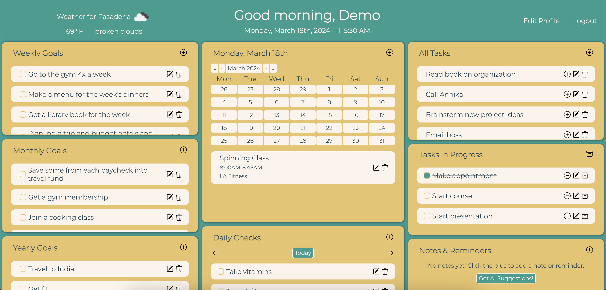
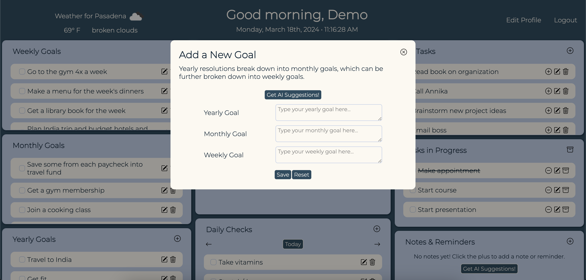
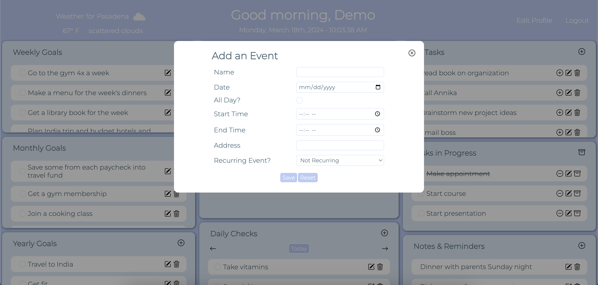

# Mosaic Planner

Your goals, schedule & reminders, all in one place.

## Description

This project is a full-stack application that combines different aspects of a traditional planner: a calendar, schedule, daily items, reminders/notes, tasks and goals. A user will be able to add, view, update and delete anything via the dashboard.

Technologies used in this application include:
- React
- MySQL
- Sequelize
- Node
- Express
- Emotion
- Express Session
- bcrypt
- ChatGPT API
- Open Weather API
- <a href="https://www.npmjs.com/package/react-calendar">React Calendar</a>

## Usage

This project has been deployed at: https://mosaic-planner-112e49ce3b90.herokuapp.com/

## Credits

This project was created by Ramita Indurkhya.